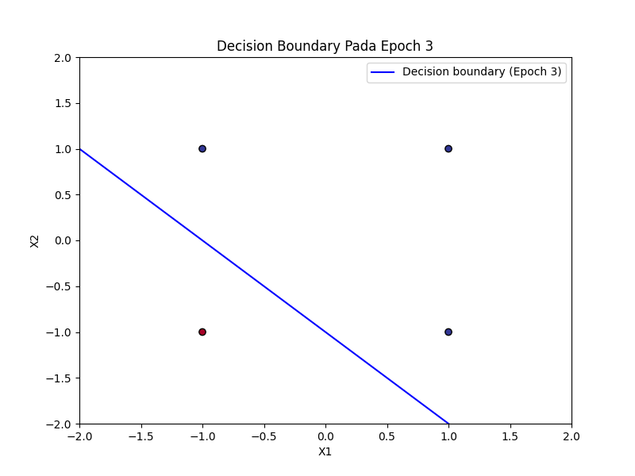
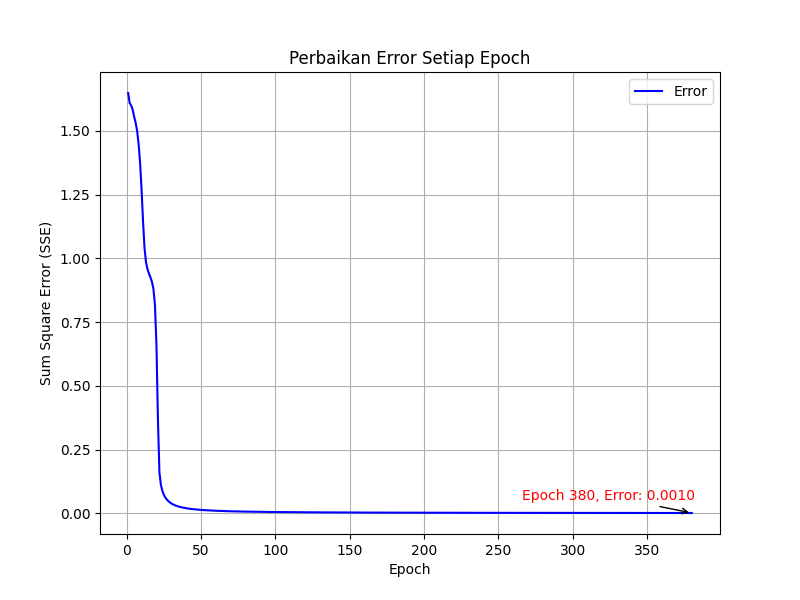

# Praktikum Kecerdasan Buatan - Pertemuan 6 (Neural Network)

Repository ini berisi implementasi algoritma Neural Network, yaitu Perceptron dan Backpropagation, menggunakan bahasa pemrograman Python. Proyek ini bertujuan untuk menyelesaikan masalah klasifikasi pada gerbang logika OR (linear) dan XOR (non-linear).

## Deskripsi Algoritma

### 1. Perceptron
Perceptron adalah model Neural Network yang paling sederhana, digunakan untuk mengklasifikasikan data yang dapat dipisahkan secara linear (*linearly separable*).
*   **Kasus**: Gerbang Logika OR.
*   **Fungsi Aktivasi**: Bipolar (mengembalikan nilai 1 atau -1).
*   **Parameter**:
    *   Learning Rate (alpha): 0.1
    *   Maksimal Epoch: 10
*   **Output**: Garis pemisah (*decision boundary*) yang memisahkan kelas input.

### 2. Backpropagation
Backpropagation adalah algoritma pelatihan untuk Multi-Layer Perceptron yang mampu menyelesaikan masalah non-linear dengan menyesuaikan bobot berdasarkan error yang dipropagasikan balik.
*   **Kasus**: Gerbang Logika XOR.
*   **Arsitektur**:
    *   Input Layer: 2 neuron
    *   Hidden Layer: 2 neuron
    *   Output Layer: 1 neuron
*   **Fungsi Aktivasi**: Sigmoid Bipolar (Tanh) untuk semua layer.
*   **Parameter**:
    *   Learning Rate (alpha): 0.3
    *   Maksimal Epoch: 1000
    *   Target Error (SSE): 0.001

## Daftar File
*   **Perceptron.py**: Modul berisi kelas Perceptron dan logika pelatihannya.
*   **Perceptron_or.py**: Skrip eksekusi untuk pengujian gerbang logika OR.
*   **Backpropagation.py**: Modul berisi kelas Backpropagation dengan mekanisme forward dan backward propagation.
*   **Backpropagation_xor.py**: Skrip eksekusi untuk pengujian gerbang logika XOR.

## Prasyarat
Pastikan library berikut telah terinstal di lingkungan Python Anda:
```bash
pip install numpy matplotlib
```

## Cara Menjalankan
Jalankan skrip berikut melalui terminal untuk memulai proses pelatihan:

**Pengujian Perceptron:**
```bash
python Perceptron_or.py
```

**Pengujian Backpropagation:**
```bash
python Backpropagation_xor.py
```

## Hasil dan Visualisasi

### Visualisasi Grafik
Setelah pelatihan selesai, program akan secara otomatis menghasilkan grafik berikut:

*   **Perceptron (Decision Boundary)**: Menunjukkan bagaimana model memisahkan data input OR secara spasial.
    

*   **Backpropagation (Error Improvement)**: Menunjukkan grafik penurunan Sum Square Error (SSE) terhadap jumlah epoch hingga mencapai target error.
    

### File Log Output
Detail proses pelatihan per iterasi dapat dilihat pada file teks berikut:
*   `HasilPerceptron.txt`: Log bobot, bias, dan error untuk Perceptron.
*   `hasilBackpropagation.txt`: Log detail forward dan backward propagation untuk Backpropagation.

---
